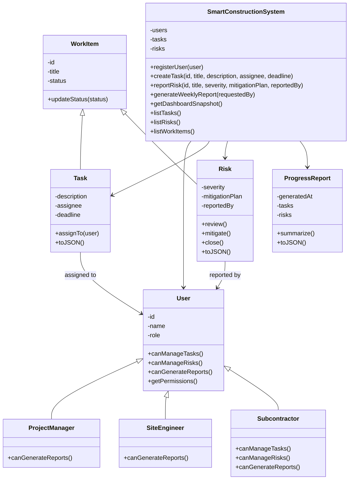

# Class Diagram

The following class diagram represents the main object-oriented structure of the Smart Construction Site Coordination System MVP.

## Object-Oriented Design Notes

- Encapsulation is applied through private class fields such as `#id`, `#status`, and `#role`.
- Inheritance is used in the `User` hierarchy and the `WorkItem` hierarchy.
- Polymorphism is used when different user subclasses respond differently to the same permission methods.
